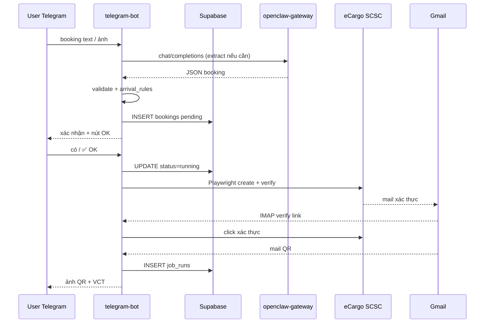
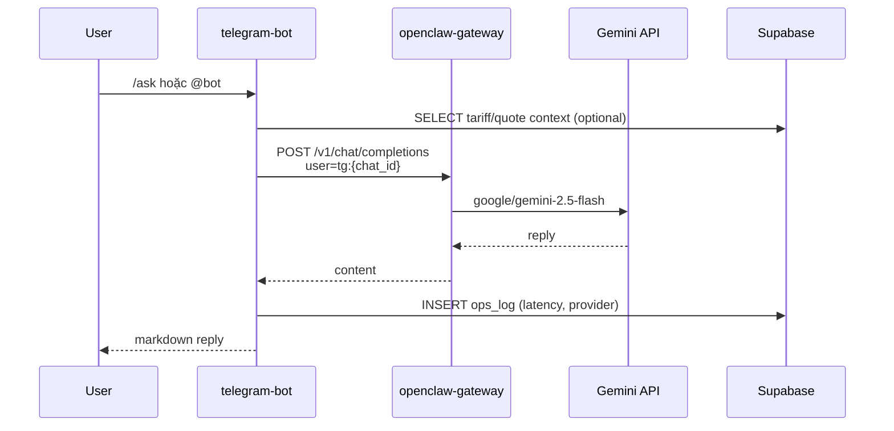
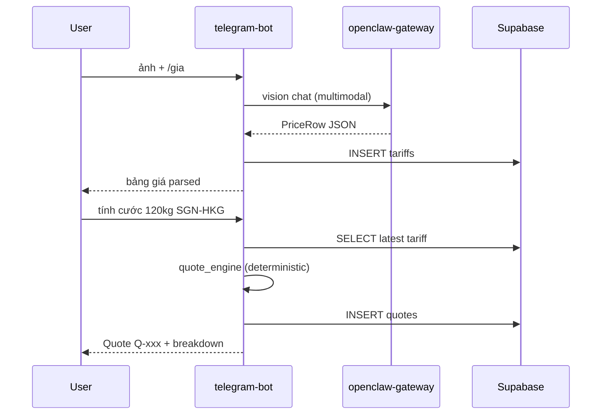

# Kiến trúc kỹ thuật — open_claw

> **Cập nhật:** production chỉ `openclaw-gateway`. Phần Telegram bot trong tài liệu cũ đã gỡ khỏi monorepo.

Bổ sung chi tiết cho [PLATFORM.md](./PLATFORM.md).

---

## 1. Lớp kiến trúc (4 tầng)

```
┌─────────────────────────────────────────────────────────────┐
│ L1 — Channels          Telegram (production)                 │
├─────────────────────────────────────────────────────────────┤
│ L2 — Apps              telegram-bot │ openclaw-gateway       │
├─────────────────────────────────────────────────────────────┤
│ L3 — Platform          Supabase Postgres + Storage           │
├─────────────────────────────────────────────────────────────┤
│ L4 — External          Google Gemini · Gmail · eCargo SCSC   │
└─────────────────────────────────────────────────────────────┘
```

LLM production: **Gemini only** — chi tiết [MODELS.md](./MODELS.md).

### Nguyên tắc phân tách

| Quy tắc | Lý do |
|---------|-------|
| **Một Telegram token** — chỉ `telegram-bot` | Tránh double polling |
| **Gateway không Playwright** | Image Docker nhẹ, scale riêng |
| **Bot không gọi Gemini trực tiếp** | Chỉ qua OpenClaw Gateway (memory/persona) |
| **LLM duy nhất = Gemini** | Không DeepSeek / OpenAI trên Railway |
| **Supabase chỉ từ bot** | Gateway không cần DB credentials |
| **Quote engine deterministic trên bot** | Audit số tiền, không tin LLM nhân giá |

---

## 2. Sequence — Booking eCargo



---

## 3. Sequence — Chat AI + memory



**Session key OpenClaw:** `user: "tg:{chat_id}"` — giữ memory theo nhóm Telegram.  
**Provider:** chỉ Gemini (`GEMINI_API_KEY` trên gateway).

---

## 4. Sequence — Đọc ảnh + báo giá (gói B)



---

## 5. Hợp đồng HTTP — Bot → Gateway

### 5.1 Chat text

```http
POST http://openclaw-gateway.railway.internal:18789/v1/chat/completions
Authorization: Bearer {OPENCLAW_GATEWAY_TOKEN}
Content-Type: application/json

{
  "model": "openclaw/default",
  "user": "tg:-1001234567890",
  "messages": [
    { "role": "system", "content": "..." },
    { "role": "user", "content": "..." }
  ],
  "temperature": 0.4,
  "max_tokens": 600,
  "stream": false
}
```

### 5.2 Vision (multimodal — phase 4)

Mở rộng `AIClient.chat_vision()` — payload OpenAI-compatible với `image_url` base64 hoặc endpoint responses API của OpenClaw.

### 5.3 Health probe

```http
GET /v1/models
Authorization: Bearer {token}
```

Bot startup (`session_health.check_openclaw_health`) — log + `ops_log` nếu fail.

### 5.4 Timeout matrix

| Call type | Connect | Total | Retry |
|-----------|---------|-------|-------|
| Chat nhanh | 5s | 90s | 0 |
| Booking extract | 5s | 120s | 1 |
| Vision ảnh | 5s | 180s | 0 |
| `/cursor` local | — | — | Tắt prod |

---

## 6. Module map — `apps/telegram-bot`

```
apps/telegram-bot/
├── bot/
│   ├── main.py                 # entry
│   └── handlers/
│       ├── unified.py          # router chính
│       ├── go.py               # eCargo job
│       ├── image_reader.py     # /gia
│       ├── scale_ticket.py     # /can
│       └── quote.py            # NEW /bao_gia
├── core/
│   ├── settings.py
│   ├── ai_client.py            # router → OpenClaw
│   ├── openclaw_client.py
│   └── supabase_client.py      # NEW
├── plugins/
│   ├── vct_order/              # Playwright + mail
│   ├── chat/                   # orchestrator
│   ├── image_reader/
│   │   ├── quote_engine.py     # NEW deterministic
│   │   └── quote_parse.py      # NEW
│   └── scale_ticket/
└── workspace/                  # COPY cho gateway mount
    ├── IDENTITY.md
    ├── SOUL.md
    ├── USER.md
    └── TOOLS.md
```

---

## 7. Gateway workspace sync

OpenClaw agent đọc persona từ workspace. Trên Railway:

**Cách A (khuyến nghị):** Dockerfile gateway `COPY` thư mục `workspace/` từ build context monorepo.

```dockerfile
COPY apps/telegram-bot/workspace /app/workspace/telegram-bot
```

**Cách B:** Shared Railway volume (phức tạp hơn) — không dùng giai đoạn đầu.

Mỗi deploy bot → rebuild gateway nếu đổi IDENTITY/SOUL (hoặc CI build cả hai).

---

## 8. Supabase access pattern

```python
# core/supabase_client.py — interface thiết kế

class SupabaseStore:
    async def save_booking_pending(chat_id, raw_text, parsed) -> uuid
    async def update_booking_status(id, status, error=None)
    async def save_job_run(booking_id, chat_id, result: JobResult)
    async def save_tariff(chat_id, rows_json, source) -> uuid
    async def get_latest_tariff(chat_id) -> Tariff | None
    async def save_quote(chat_id, quote: QuoteResult) -> str  # quote_code
    async def save_scale_ticket(chat_id, ticket: ScaleTicket)
    async def upsert_customer(reg_no, name)
    async def log_ops(level, source, message, meta=None)
```

**Không** dùng Supabase Realtime giai đoạn 1 — bot poll DB khi cần.

---

## 9. Plugin roadmap (open_claw repo)

| Plugin | Môi trường | Mục đích |
|--------|------------|----------|
| `cursor-agent` | Local only | Dev `/cursor` |
| `supabase-memory` | Gateway (future) | Agent đọc ops_log / tariff |
| `namnam-ops` | Gateway (future) | Tool tra booking từ Supabase |
| `gemini-vision-task` | Gateway | Task template vision logistics |

Chi tiết: [PLUGIN_ROADMAP.md](./PLUGIN_ROADMAP.md)

---

## 10. Giám sát & alert

### 10.1 Health checks (bot startup)

| Check | Fail action |
|-------|-------------|
| OpenClaw `/v1/models` | Telegram alert + fallback message trong SOUL |
| Supabase ping | Log warn, tiếp tục không persist |
| eCargo session file | Alert + hướng dẫn `save_ecargo_session` |
| Gmail IMAP | Alert |

### 10.2 `ops_log` events chuẩn

| `source` | `message` ví dụ |
|----------|-----------------|
| `openclaw` | `chat_ok latency_ms=420` |
| `openclaw` | `chat_fail code=timeout` |
| `ecargo` | `job_error arrival_too_soon` |
| `gmail` | `imap_disconnect` |
| `quote` | `quote_created Q-20260709-A3F2` |

### 10.3 Railway metrics (manual)

- CPU/RAM `telegram-bot` (Playwright nặng)
- RAM `openclaw-gateway` (nhẹ)
- Gemini quota dashboard Google AI Studio

---

## 11. Môi trường (environments)

| Env | Railway | Supabase | Telegram |
|-----|---------|----------|----------|
| `production` | project `open_claw` | project `open_claw` | Bot chính |
| `local` | không | local hoặc branch dev | token test |
| `ci` | không | ephemeral / mock | mock |

**Không** tách staging Railway giai đoạn 1 — dùng `ALLOWED_CHAT_IDS` nhóm test nếu cần.

---

## 12. Index tài liệu

| File | Nội dung |
|------|----------|
| [PLATFORM.md](./PLATFORM.md) | Tổng quan + lộ trình |
| [ARCHITECTURE.md](./ARCHITECTURE.md) | File này — sequence + module |
| [DATA.md](./DATA.md) | Schema + JSON types |
| [QUOTE_ENGINE.md](./QUOTE_ENGINE.md) | Báo giá deterministic |
| [RUNBOOK.md](./RUNBOOK.md) | Vận hành ngày |
| [PLUGIN_ROADMAP.md](./PLUGIN_ROADMAP.md) | Plugin tương lai |
