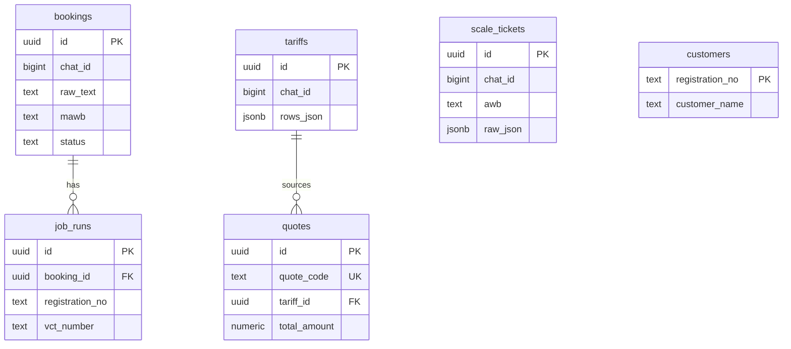

# Mô hình dữ liệu — open_claw / Supabase

Chi tiết schema, JSON types, và mapping từ code hiện tại.

---

## 1. ERD (rút gọn)



---

## 2. Bảng `bookings`

| Cột | Type | Nguồn code |
|-----|------|------------|
| `raw_text` | text | `parse_booking()` input |
| `vehicle_no` | text | `Booking.vehicle_no` |
| `flight` | text | `Booking.flight` |
| `flight_date` | text | `Booking.flight_date` |
| `mawb` | text | `Booking.mawb` |
| `pcs` | int | YAML default hoặc parsed |
| `gross_weight` | numeric | YAML default hoặc parsed |
| `status` | text | `pending` → `running` → `done`/`error`/`cancelled` |

**Thay thế:** `job_tracker.PendingBooking` trong `chat_data`.

---

## 3. Bảng `job_runs`

| Cột | Map từ |
|-----|--------|
| `registration_no` | `JobResult.registration_no` |
| `vct_number` | `JobResult.vct_number` |
| `verify_code` | `JobResult.verify_code` |
| `status_text` | `JobResult.status_text` |
| `error_raw` | exception / catalog id |

---

## 4. JSON `tariffs.rows_json`

Mảng `PriceRow` (từ `plugins/image_reader/models.py`):

```json
[
  {
    "route": "SGN-HKG",
    "cargo_type": "general",
    "weight_min_kg": 0,
    "weight_max_kg": 45,
    "weight_range": "0-45kg",
    "price_per_kg": 18500,
    "currency": "VND",
    "notes": ""
  }
]
```

---

## 5. JSON `quotes.breakdown_json`

```json
{
  "matched_row": {
    "route": "SGN-HKG",
    "weight_range": "45-100kg",
    "price_per_kg": 16000
  },
  "line_items": [
    { "label": "cước_kg", "amount": 1920000, "formula": "16000 x 120" },
    { "label": "fuel_surcharge", "amount": 0, "pct": 0 },
    { "label": "min_charge", "amount": 0 }
  ],
  "disclaimer": "Chưa gồm VAT/customs. Giá chốt khi booking.",
  "tariff_source": "vision+ocr 2026-07-09T14:32"
}
```

**`quote_code` format:** `Q-{YYYYMMDD}-{4 hex}` — ví dụ `Q-20260709-A3F2`.

---

## 6. JSON `scale_tickets.raw_json`

Full `ScaleTicket.to_dict()` + OCR source:

```json
{
  "awb": "618-53186840",
  "flight": "SQ185",
  "flight_date": "21MAY",
  "pieces": 3,
  "gross_kg": 120,
  "chargeable_kg": 127,
  "form_type": "SCSC",
  "source": "ocr+vision"
}
```

---

## 7. Storage buckets

| Bucket | Path pattern | Retention |
|--------|--------------|-----------|
| `qr-images` | `{chat_id}/{reg_no}.png` | 90 ngày |
| `documents` | `{chat_id}/{uuid}.jpg` | 180 ngày |

Migration: `supabase/migrations/20260709110000_storage.sql`

---

## 8. Mapping file JSON → Supabase

| File cũ | Bảng mới |
|---------|----------|
| `data/reg_customer.json` | `customers` |
| `data/ecargo_error_journal.jsonl` | `ops_log` |
| `chat_data.pending_booking` | `bookings` status=pending |
| `chat_data.last_image_read` | `tariffs` (latest per chat) |
| `chat_data.ai_history` | Giữ in-memory + `chat_sessions` metadata |

**Không migrate:** `ecargo_storage.json` — vẫn file trên Railway Volume (cookies Playwright).

---

## 9. Query patterns thường dùng

```sql
-- Booking pending của nhóm
SELECT * FROM bookings
WHERE chat_id = $1 AND status = 'pending'
ORDER BY created_at DESC LIMIT 1;

-- Tariff mới nhất
SELECT * FROM tariffs
WHERE chat_id = $1
ORDER BY created_at DESC LIMIT 1;

-- Quote tra mã
SELECT * FROM quotes WHERE quote_code = $1;

-- Job hôm nay
SELECT * FROM job_runs
WHERE started_at >= CURRENT_DATE
ORDER BY started_at DESC;

-- Lỗi eCargo 24h
SELECT * FROM ops_log
WHERE source = 'ecargo' AND level = 'error'
  AND created_at > now() - interval '24 hours';
```

---

## 10. Index bổ sung (phase 3)

Đã có trong `20260709100000_initial.sql`. Thêm khi scale:

- `job_runs (started_at DESC)`
- `ops_log (source, level, created_at)`
